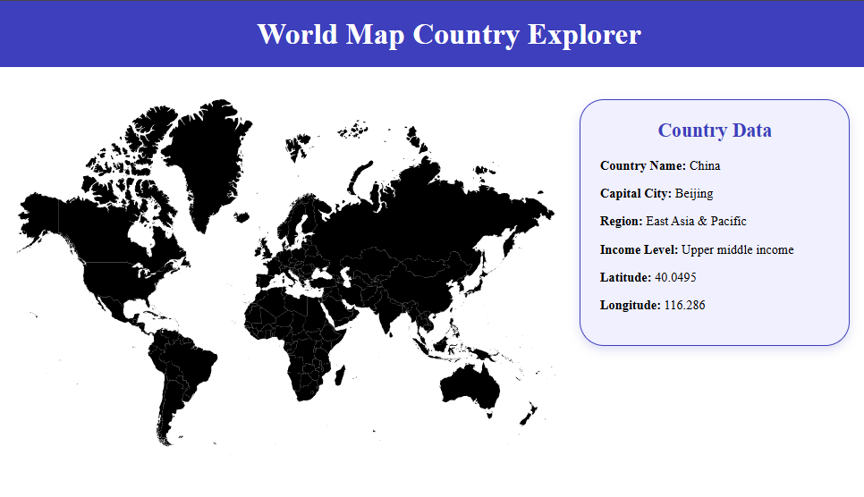

# World Map Angular Project

This project is a simple angular application that displays a world map, allowing users to click on different countries to retrieve and display specific information about each country. 

## Preview



---

## Features

- Interactive SVG world map
- Country information retrieval using the World Bank API
- Dynamic country detail display
- Angular routing and component structure

---

## Running the Project

1. Clone the repository:

```bash
git clone https://github.com/josierra21/worldmap_angular.git
```

2. Navigate into the Angular project folder:

```bash
cd worldmap_angular/angular
```

3. Install dependencies:

```bash
npm install
```

4. Start the Angular development server:

```bash
npx ng serve
```

5. Open the application in your browser:

```text
http://localhost:4200/map
```

6. Click on a country on the map to retrieve and display country information.

---

